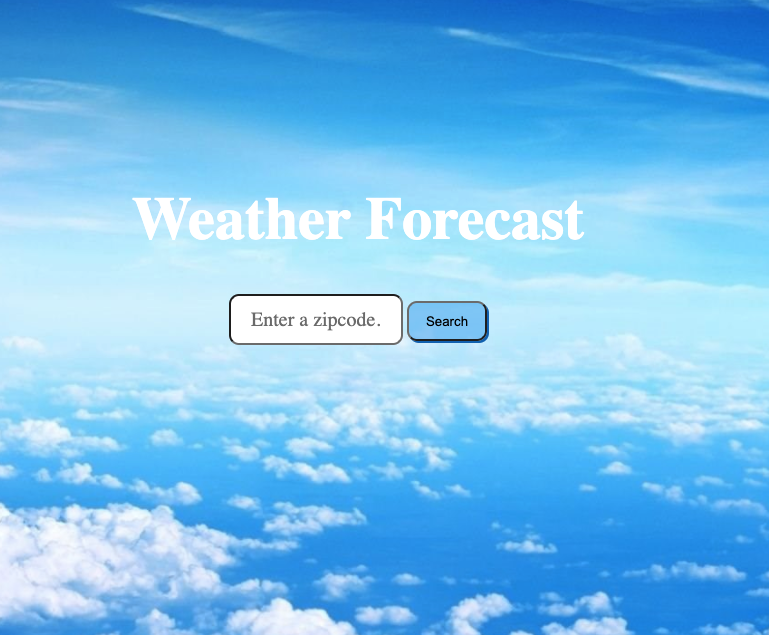

# Wheather Forecast

Overview

This is a 5 day weather forecast that utilizes the Accu Weather API https://developer.accuweather.com/accuweather-alerts-api/apis to extract the weather data and display 5 day forecast by the search of each zip code.

Technology used to build this app: 

Javascript,
HTML,
CSS,
jQuery, and 
Accu API

App features

* Queries and processes Accu weather API  data into a five day forecast
* Gets the current location by searching with the zipcode. 
* Mobile, tablet, and desktop responsive
